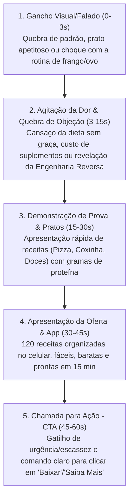

# Padrões e Inteligência dos Anúncios Vencedores

> **Base de Análise:** 8 anúncios vencedores ativos há mais de 80 dias na Biblioteca da Meta da oferta de referência (*FIT. Pro*).

---

## 1. Mapeamento dos Ganchos (Primeiros 3 Segundos)

Todos os 8 criativos vencedores utilizam ganchos agressivos de retenção imediata baseados em quebra de expectativa ou dor sensorial:

| Anúncio | Ângulo do Gancho | Tipo de Gancho | Frase de Abertura (0-3s) |
| :--- | :--- | :--- | :--- |
| **01** | *Food Porn Saudável* | Quebra de Expectativa Visual | *"Se alguém mostrasse essas receitas pra você sem explicar nada, você nunca diria que são saudáveis..."* |
| **02** | *UGC / Fofoca / Storytelling* | Relato Cômico & Espontâneo | *"E eu que comecei a emagrecer só seguindo essas receitas proteicas com gosto de comida gorda..."* |
| **03** | *Mecanismo Secreto* | Curiosidade & Revelação | *"Por que quase ninguém fala sobre isso? Você sabia que, graças à engenharia reversa do sabor..."* |
| **04** | *Inimigo Comum / Confronto* | Choque & Revolta Financeira | *"Essas receitas são um tapa na cara de quem diz que não dá pra emagrecer e bater meta de proteína comendo bem..."* |
| **05** | *POV / Personificação* | Polêmica & Humor | *"Será que eu NÃO sou saudável? O papo que rola nas redes sociais é que não sou comida de dieta..."* |
| **06** | *Dor da Monotonia* | Pergunta Direta ao Ponto | *"Tá precisando bater os macros e está achando difícil comer sempre a mesma coisa?"* |
| **07** | *Dor Dupla (Enjoo + Bolso)* | Identificação Rápida | *"Tá precisando bater a meta de proteína, mas não aguenta mais frango e ovo e o whey tá caro?"* |
| **08** | *Atendendo a Pedidos* | Escassez & Urgência Pessoal | *"Vocês me pediram tanto por isso eu decidi fazer: tá aí as 120 receitas proteicas..."* |

---

## 2. Dores Centrais Exploradas

1. **A Monotonia do "Frango e Ovo":**
   - Imagem de tortura e desespero: *"todo dia frango e ovo, quase criando pena e voando"*.
   - A comida tradicional de dieta é descrita como *"seca, sem graça e com gosto de papelão"*.
2. **O Alto Custo dos Suplementos:**
   - Gastos de R$ 300+/mês com Whey Protein que enjoa rápido (*"não querer ver whey nem pintado de ouro"*).
   - A indústria vende suplemento porque não quer ensinar a cozinhar comida de verdade.
3. **Desistência e Falta de Aderência:**
   - Dificuldade em manter dietas restritivas por mais de 2 ou 3 semanas devido à vontade incontrolável de comer comida gostosa (pizza, hambúrguer, doces, coxinha).
4. **Falta de Tempo e Habilidade Culinária:**
   - Medo de que comida saudável saborosa exija horas na cozinha ou habilidades de chef.

---

## 3. Desejos e Promessas de Transformação

1. **Sabor de "Comida Gorda" com Macros de Atleta:**
   - Comer coxinha (20g prot), pizza de frigideira (22g prot), lasanha de fricassê (28g prot), hambúrguer (até 60g prot) e brigadeiro (10g prot) batendo a meta diária.
2. **Praticidade Extrema:**
   - Preparo em menos de 15 minutos.
   - Ingredientes simples e baratos que qualquer pessoa já tem na geladeira.
3. **Economia Financeira:**
   - Substituição total ou parcial de Whey Protein caro por comida de verdade.
4. **Organização sem Complicação:**
   - 120 receitas separadas por categorias claras: *Café da manhã, Almoço, Jantar, Lanches e Doces*, direto no celular.

---

## 4. Mecanismos e Elementos de Posicionamento

- **Engenharia Reversa do Sabor:** Conceito central que explica *como* é possível transformar pratos calóricos populares em bombas proteicas saudáveis sem perder o sabor original.
- **Turbinadas de Proteína:** Linguagem enérgica focada em hipertrofia e saciedade sem calorias vazias.
- **Acessibilidade Total:** Enfatizar que *"qualquer pessoa comum consegue fazer em 15 minutos"*.

---

## 5. Estrutura Padrão dos Criativos de Conversão (Template Vencedor)

---

## 6. Diretrizes de Modelagem para os Nossos Criativos (Fase 5)

1. **Sem Cópia Literal:** Criaremos novos nomes de pratos, novas metáforas e novos roteiros autorais seguindo exatamente a mesma dinâmica psicológica de retenção.
2. **Ângulos Diversificados:** Cobriremos os mesmos 8 pilares testados (Sensorial, UGC Storytelling, Inimigo Comum/Economia, Curiosidade de Mecanismo, Personificação/POV, Dor da Mesmice, Dor Dupla e Urgência Sazonal).
3. **Formatos Nativos:** Roteiros estruturados para gravação vertical (9:16), legendas formatadas com espaçamento e emojis funcionais para alto engajamento.
