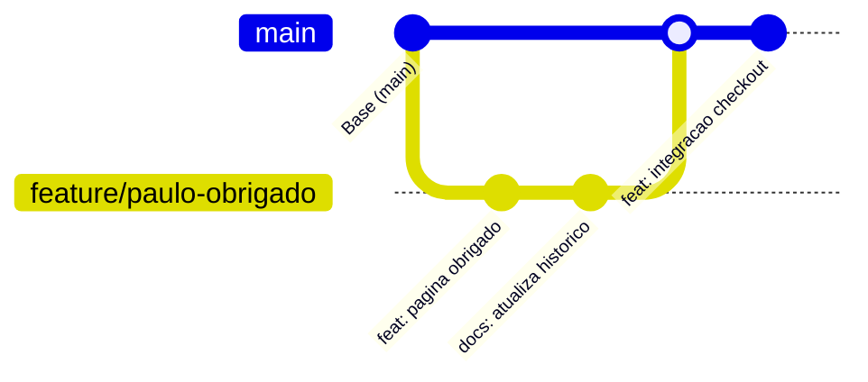

# 🤝 Manual de Boas Práticas — Trabalho em Equipe (Paulo & Pedro)

Este manual estabelece os padrões operacionais, de versionamento e de comunicação para o desenvolvimento conjunto do projeto **Prot+**, garantindo sincronia, zero retrabalho e rastreabilidade total entre **Paulo Henrique** e **Pedro Henrique**.

---

## 🧭 Os 4 Pilares da Dupla

1. **Rastreabilidade:** Toda alteração tem um autor claro e deve estar documentada no Git e no [HISTORICO_ATUALIZACOES.md](file:///Volumes/HIKSEMI/Uso%20do%20Mabook/Projetos%20Pedrinho/PROT-/HISTORICO_ATUALIZACOES.md).
2. **Sincronia Preventiva:** "Puxe antes de começar, avise antes de alterar arquivos centrais, empurre assim que validar."
3. **Portabilidade:** O código roda identicamente no **Mac** (Paulo) e no **Windows** (Pedro). Caminhos absolutos são terminantemente proibidos.
4. **Mobile-First Real:** Toda e qualquer tela (PWA, página de vendas, página de obrigado) deve ser validada primeiro na largura de **390 px**.

---

## 💻 1. Configuração dos Ambientes (Mac vs Windows)

Como o Paulo usa **macOS** e o Pedro usa **Windows**, ajustes simples evitam conflitos de sistema e quebras de linha:

### A. Identidade Git Local (em cada máquina)

Cada irmão deve garantir que seus commits saiam com seu próprio nome e e-mail.

**No Mac do Paulo:**
```bash
git config --local user.name "Paulo Henrique"
git config --local user.email "phenrimedeiros@gmail.com"
```

**No Windows do Pedro:**
```bash
git config --local user.name "Pedro Henrique"
git config --local user.email "pedro.arqtt@gmail.com"
```

> [!TIP]
> Use `--local` para aplicar apenas dentro deste repositório sem alterar outros projetos do seu computador.

### B. Normalização de Fim de Linha (Line Endings)
O Windows usa `CRLF` (`\r\n`) e o Mac usa `LF` (`\n`). Sem essa configuração, o Git pode marcar arquivos inteiros como alterados só pela quebra de linha.

- **No Mac (Paulo):**
  ```bash
  git config core.autocrlf input
  ```
- **No Windows (Pedro):**
  ```bash
  git config core.autocrlf true
  ```

### C. Regra Sagrada: NUNCA usar Caminhos Absolutos
- ❌ **Proibido:** `file:///c:/Users/Pedro/...` ou `/Volumes/HIKSEMI/Uso do Mabook/...`
- ✅ **Correto:** Sempre caminhos relativos ao projeto:
  - Em HTML: `href="images/SOB-001.png"` ou `src="./script.js"`
  - Em JS: `fetch('./dados/receitas.json')`
  - Em documentação: links relativos `[Blueprint](./02-blueprint/blueprint.md)`

---

## 🔄 2. Fluxo de Trabalho Git (Git Flow Prático)

Para uma equipe de duas pessoas, um fluxo ágil e sem burocracia excessiva é o ideal:



### A. A Regra de Ouro: Sempre Dar Pull Antes de Iniciar
Antes de abrir o editor ou alterar qualquer linha:
```bash
git pull --rebase origin main
```
> O `--rebase` mantém o histórico linear e limpo, evitando commits vazios de *"Merge branch 'main' into..."*.

### B. Quando Usar a `main` Direto vs Branches

| Cenário | Estratégia Recomendada |
|---|---|
| Correção rápida de texto, ajuste de bug pequeno, atualização de docs | Direto na `main` (comunicando o irmão) |
| Nova página (ex: Página de Obrigado / Upsell), grande refatoração de CSS/JS | Criar branch: `feature/paulo-obrigado` ou `feature/pedro-novo-modulo` |
| Modificações no banco de dados (`receitas.json`) | Criar branch ou fazer com comunicação direta prévia |

### C. Como Trabalhar com Branches (Passo a Passo)

1. **Criar e entrar na sua branch:**
   ```bash
   git checkout -b feature/nome-da-tarefa
   ```
2. **Desenvolver, testar localmente e commitar:**
   ```bash
   git add .
   git commit -m "feat: implementa nova funcionalidade"
   ```
3. **Antes de unir com a main, atualizar com o que o irmão fez:**
   ```bash
   git checkout main
   git pull origin main
   git checkout feature/nome-da-tarefa
   git rebase main
   ```
4. **Mesclar na main e enviar para o GitHub:**
   ```bash
   git checkout main
   git merge feature/nome-da-tarefa
   git push origin main
   git branch -d feature/nome-da-tarefa
   ```

---

## 💬 3. Prevenção de Conflitos ("Locking Conversacional")

Arquivos estáticos grandes como `04-pagina/index.html` e `03-produto/dados/receitas.json` são propensos a conflitos se ambos editarem simultaneamente.

### Regra de Comunicação no WhatsApp/Discord:
- **Antes de editar:** Mande uma mensagem:
  > *"Paulo/Pedro, vou mexer no `index.html` da página de vendas agora durante 1h."*
- **Depois de terminar:**
  > *"Terminei e já dei push na main. Pode dar pull!"*

### Se Houver Conflito de Merge (Como Resolver):
1. O Git avisará quais arquivos estão com conflito (`CONFLICT (content)`).
2. Abra o arquivo no editor — procure pelos marcadores:
   ```text
   <<<<<<< HEAD
   Código que já estava no repositório
   =======
   Código que você acabou de escrever
   >>>>>>> seu-commit
   ```
3. Converse com o irmão, mantenha as duas partes ou a versão correta, remova os marcadores (`<<<<<<<`, `=======`, `>>>>>>>`).
4. Salve, teste no navegador e finalize:
   ```bash
   git add .
   git rebase --continue   # ou git commit se foi merge
   git push origin main
   ```

---

## 🏷️ 4. Padrão Semântico de Commits

Use mensagens claras seguindo o padrão Conventional Commits em português:

| Prefixo | Significado | Exemplo Real |
|---|---|---|
| `feat:` | Nova funcionalidade ou recurso | `feat: adiciona pagina de obrigado com upsell` |
| `fix:` | Correção de bug ou erro visual | `fix: corrige calculo de proteinas no rastreador` |
| `docs:` | Mudança apenas em documentação | `docs: registra atualizacoes no historico` |
| `style:` | Ajuste de espaçamento, CSS, formatação visual | `style: ajusta contraste do botao CTA mobile` |
| `refactor:` | Refatoração de código sem mudar comportamento | `refactor: simplifica funcao de busca do PWA` |
| `chore:` | Tarefas rotineiras, configs, dependências | `chore: atualiza .gitignore para ignorar temporarios` |

---

## 📝 5. Registro Contínuo de Progresso e Autoria

A cada entrega ou encerramento de sessão de trabalho:

1. **Atualizar o [HISTORICO_ATUALIZACOES.md](file:///Volumes/HIKSEMI/Uso%20do%20Mabook/Projetos%20Pedrinho/PROT-/HISTORICO_ATUALIZACOES.md):**
   - Adicionar uma nova entrada com a data, seu nome (Paulo ou Pedro), o que foi feito e os arquivos impactados.
2. **Atualizar o [PROGRESSO.md](file:///Volumes/HIKSEMI/Uso%20do%20Mabook/Projetos%20Pedrinho/PROT-/PROGRESSO.md):**
   - Marcar com `[x]` as etapas concluídas e atualizar o campo "Onde Paramos / Próximo Passo Imediato".

---

## 🧪 6. Checklist de Validação Local Pré-Push

Antes de rodar `git push origin main`, siga este checklist:

- [ ] **Servidor local rodando:** `node local-preview-server.mjs`
- [ ] **Acesso validado:**
  - Raiz: `http://127.0.0.1:4174/` (redireciona para `/04-pagina/`)
  - App PWA: `http://127.0.0.1:4174/03-produto/app/`
- [ ] **Teste Mobile (390 px):** Abra o DevTools (F12 ou Cmd+Option+I), ative o modo responsivo e teste na largura do iPhone 14/15 (390 px).
- [ ] **Console sem erros:** Verifique a aba *Console* — nenhum arquivo 404 (imagens ou scripts faltando) e nenhum erro de JavaScript.
- [ ] **Limpeza de arquivos de sistema:** Certifique-se de que não está subindo `.DS_Store`, `.env` ou pastas temporárias.

---

## ⚡ 7. Cheat Sheet (Resumo Diário de Comandos)

```bash
# 1. Iniciar o dia (sincronizar)
git pull --rebase origin main

# 2. Ver o que você alterou
git status
git diff

# 3. Rodar o preview local
node local-preview-server.mjs

# 4. Salvar suas mudanças
git add .
git commit -m "feat: descricao objetiva da mudanca"

# 5. Enviar para o GitHub
git push origin main

# 6. Avisar o irmão no WhatsApp: "Subi o commit X, pode puxar!"
```
